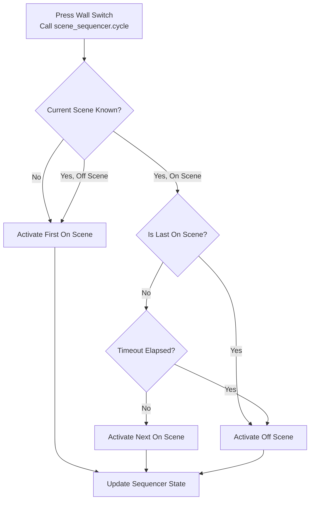

# Scene Sequencer

A Home Assistant custom integration that cycles through configured scenes sequentially, advancing with each activation. The current version uses config entries, explicit `on_scenes` plus an `off_scene`, and optional timeout behavior that sends the next activation to the off scene after a period of inactivity.

[](https://github.com/custom-components/hacs)
[](https://github.com/0x3333/scene_sequencer/releases)

## Features

- Cycle through scenes in a predetermined sequence
- Store each sequencer as its own Home Assistant config entry
- Use an explicit `off_scene` instead of implicitly treating the last scene as special(v1.0.0)
- Track position independently for multiple sequencers(In case a scene is used in more than one entry)
- Jump to the off scene if activated after a configured timeout
- Observe scene activations outside the integration and update all matching sequencers
- Allow the same scene to appear in multiple entries

## Installation

### HACS (Recommended)

1. Ensure [HACS](https://hacs.xyz/) is installed.
2. Add this repository as a custom repository in HACS:
   - Go to HACS -> Integrations -> menu -> Custom repositories
   - Add URL `https://github.com/0x3333/scene_sequencer`
   - Select category: Integration
3. Click `Download`.
4. Restart Home Assistant.

### Manual Installation

1. Copy the `scene_sequencer` folder from `custom_components` into your Home Assistant `custom_components` directory.
2. Restart Home Assistant.

## Configuration

Configuration is done through the Home Assistant UI using config flow.

After creation, entries can be edited from the integration's Configure/Edit action (options flow).

Each entry stores:

- `name`
- `on_scenes`
- `off_scene`
- `timeout`
- `transition`

`name` is mandatory and is used as the config entry title(Must be unique to be used as parameter).

`off_scene` is optional.

- If `off_scene` is configured, sequencer can transition to `off_scene` (including timeout behavior).
- If `off_scene` is not configured, sequencer keeps cycling through `on_scenes`.

`timeout` is required only when `off_scene` is configured.

`transition` defaults to `0` seconds.

## Services

### `scene_sequencer.cycle`

Activates the next scene for a configured sequencer entry.

| Parameter | Type | Required | Description |
| --------- | ---- | -------- | ----------- |
| `entry_id` | string | No | Home Assistant config entry ID for the sequencer to advance. Takes precedence over `name` |
| `name` | string | No | Entry name for the sequencer to advance. Must match exactly and be unique |
| `backward` | bool | No | The service will iterate backwards through the `on_scene` list. The behavior for everything else will be the same |

Provide at least one of `entry_id` or `name`.

### `scene_sequencer.scene_on`

Ensures the sequencer is on.

- If current state is off or unknown, activates the first `on_scene`.
- If already on an `on_scene`, does nothing.

| Parameter | Type | Required | Description |
| --------- | ---- | -------- | ----------- |
| `entry_id` | string | No | Home Assistant config entry ID for the sequencer to target. Takes precedence over `name` |
| `name` | string | No | Entry name for the sequencer to target. Must match exactly and be unique |

Provide at least one of `entry_id` or `name`.

### `scene_sequencer.scene_off`

Activates the configured `off_scene`.

| Parameter | Type | Required | Description |
| --------- | ---- | -------- | ----------- |
| `entry_id` | string | No | Home Assistant config entry ID for the sequencer to target. Takes precedence over `name` |
| `name` | string | No | Entry name for the sequencer to target. Must match exactly and be unique |

Provide at least one of `entry_id` or `name`.

## Usage Example

```yaml
automation:
  - alias: "Living Room Scene Toggle"
    trigger:
      - platform: state
        entity_id: binary_sensor.living_room_switch
        to: "on"
    action:
      - service: scene_sequencer.cycle
        data:
          entry_id: 01JABCDEF1234567890ABCDEF
```

```yaml
automation:
  - alias: "Bed Scene Toggle By Name"
    trigger:
      - platform: state
        entity_id: binary_sensor.bed_switch
        to: "on"
    action:
      - service: scene_sequencer.cycle
        data:
          name: Bed
```

```yaml
automation:
  - alias: "Bed Motion On"
    trigger:
      - platform: state
        entity_id: binary_sensor.bed_motion
        to: "on"
    action:
      - service: scene_sequencer.scene_on
        data:
          name: Bed
```

```yaml
automation:
  - alias: "Bed Motion Off"
    trigger:
      - platform: state
        entity_id: binary_sensor.bed_motion
        to: "off"
    action:
      - service: scene_sequencer.scene_off
        data:
          name: Bed
```

## How It Works(See diagram below)

Each config entry owns one independent state machine.

The integration keeps runtime state for each sequencer, including:

- Current scene
- Last activation timestamp

Behavior rules when calling `scene_sequencer.cycle`:

- If no known current scene exists, the first `on_scene` is activated.
- With `off_scene` configured:
  - If the current scene is the `off_scene`, the next call returns to and activate the first `on_scene`.
  - If the current scene is one of the `on_scenes`:
    - Timeout has elapsed, the `off_scene` is activated.
    - Timeout has not elapsed:
      - If it is the last `on_scene`, the next call activates the `off_scene`.
      - Otherwise, the next `on_scene` is activated.
- Without `off_scene` configured:
  - Calls always cycle through `on_scenes`.

If a tracked scene is activated outside the integration, the sequencer state is updated as if the integration had activated it. If that scene belongs to multiple entries, all matching entries are updated independently.

Internal service calls update the sequencer state directly before the scene is turned on, so the next press continues from the newly activated scene. The external scene tracker ignores those internal activations and only reacts to true outside `scene.turn_on` calls.

This is useful for wall switches across the house: one press turns on or advances scenes, then after a period of inactivity the next press turns the lights off in a way that feels natural to the user.

### Diagram



## External Scene Tracking

The integration listens for `scene.turn_on` calls.

If the activated scene belongs to one or more configured entries:

- Every matching entry is updated
- The next cycle call continues from that scene
- Timeout is based on that observed activation time

This means overlapping entries are supported without special ownership rules.

## Contributing

Contributions are welcome. Please feel free to submit a pull request.

## AI Assistance Disclaimer

Some parts of this project (code, documentation, or README) were generated with the assistance of AI tools. All AI-generated content has been reviewed and refined by the human author to ensure quality.

## License

This project is licensed under the MIT License. See `LICENSE` for details.
